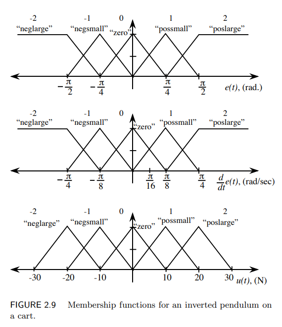
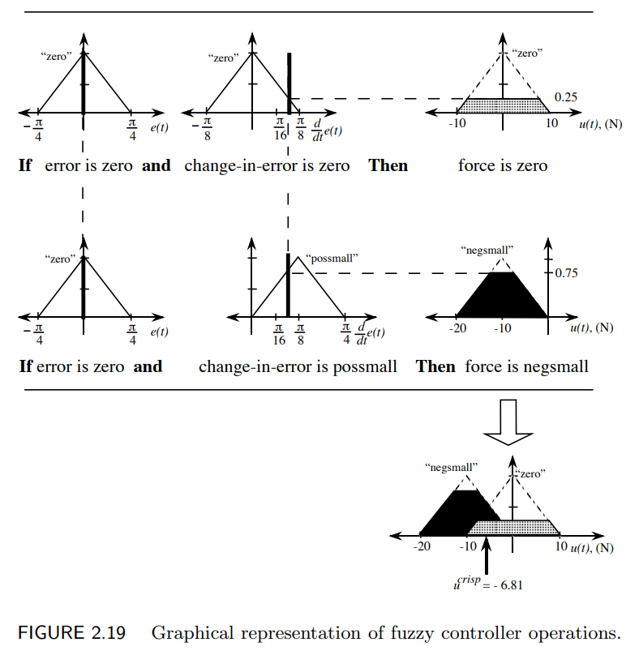

# Fuzzy: A fuzzy logic toolbox in C++

**_<< VERY MUCH A WORK IN PROGRESS >>**_

Currently, this toolbox can implement a basic mamdani fuzzy inference system, with triangular membership functions, up to 2 inputs and 1 output.

---

TODO:
- [ ] Implement more complex membership functions (Gaussian, etc.)
- [ ] Fuzzy operations (AND, OR)
- [ ] Better defuzzification methods.
- [ ] More complex inference systems (Takagi-Sugeno, etc.)
- [ ] Neater rule base implementations.
- [ ] More complex rule bases (more than 2 inputs)

